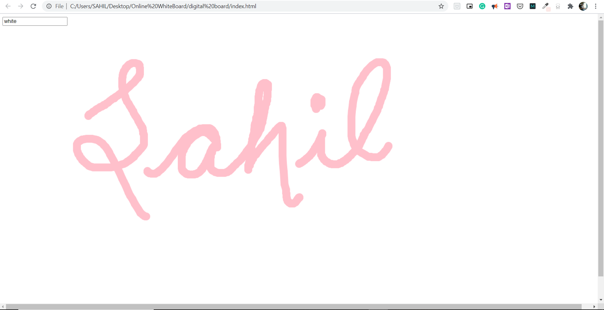

# Online-Whiteboard

 

### Show some :heart: and star the repo to support the project

## Overview
A Online Whiteboard with features of drawing whenever mouse is moved while clicked and an input box to specify color(or HEX Code) for the Drawing tool.

## Technology Stack
- HTML5 
- HTML Canvas
- JavaScript (ES6)

## Future Enhancements
- Create Drawing Tools.
- Option to Save the Canvas Drawing as pdf/image.
- Varying the Strokes of Drawing Tools.

## Getting Started 🚀
- Fork The Repo
- Clone the repo `git clone https://github.com/Sahil-kachhap/Online-Whiteboard`
